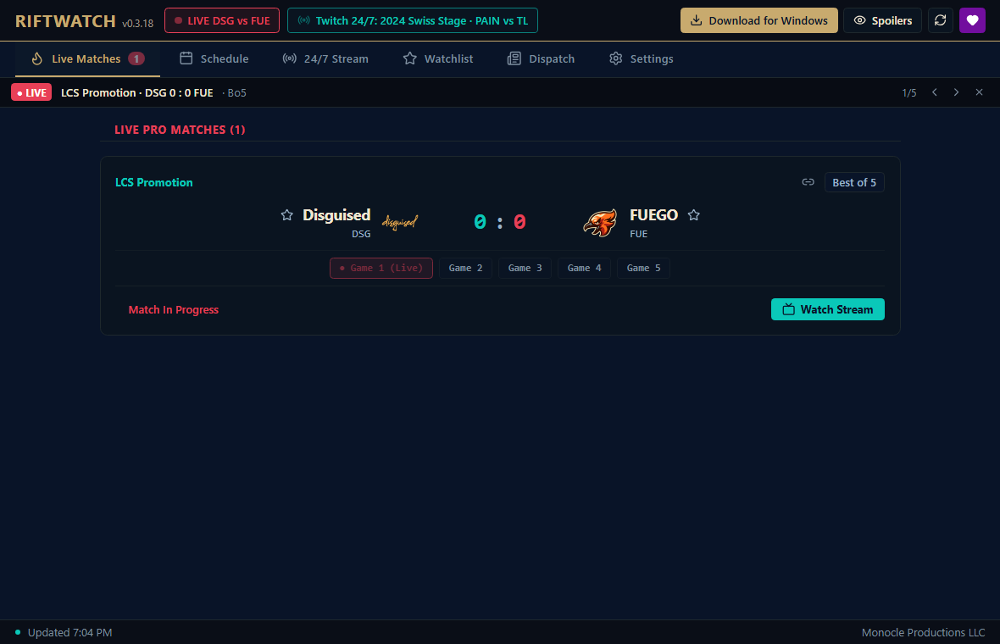
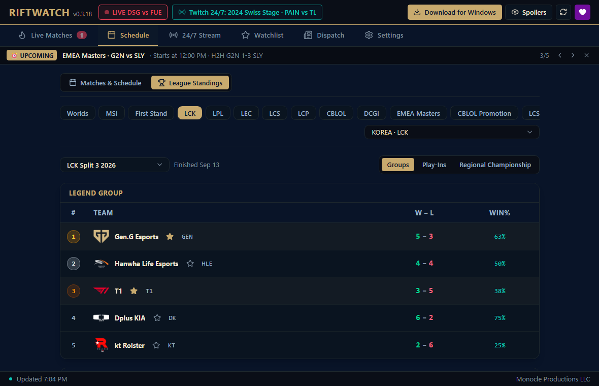
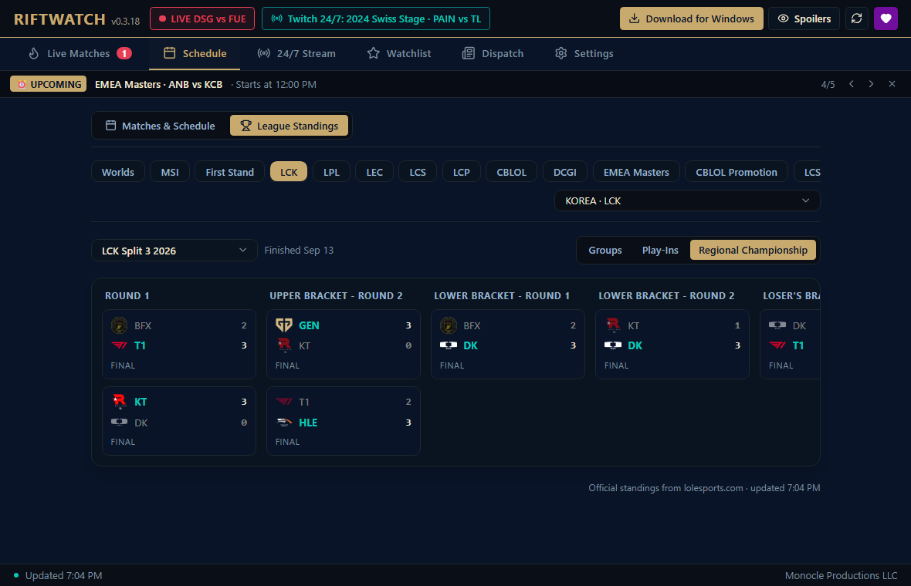
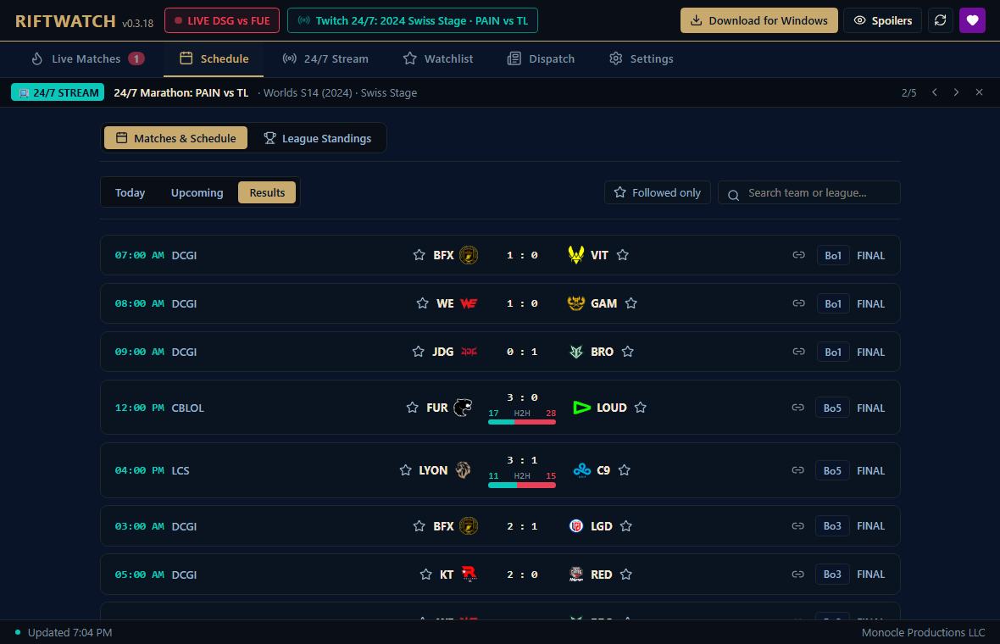
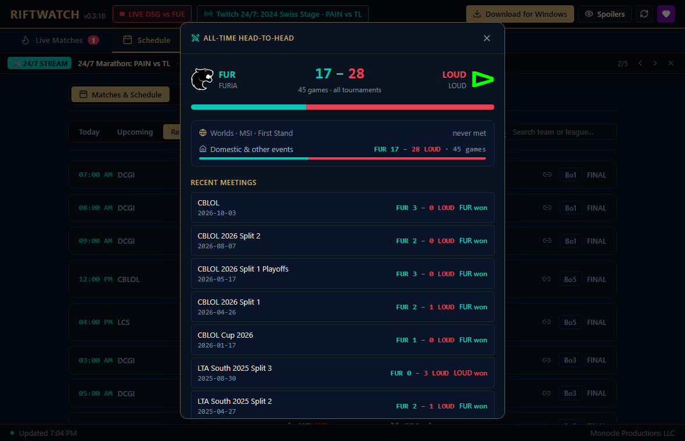
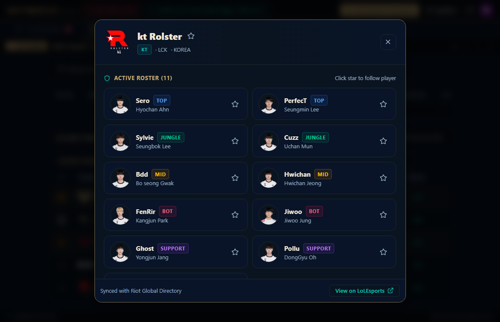
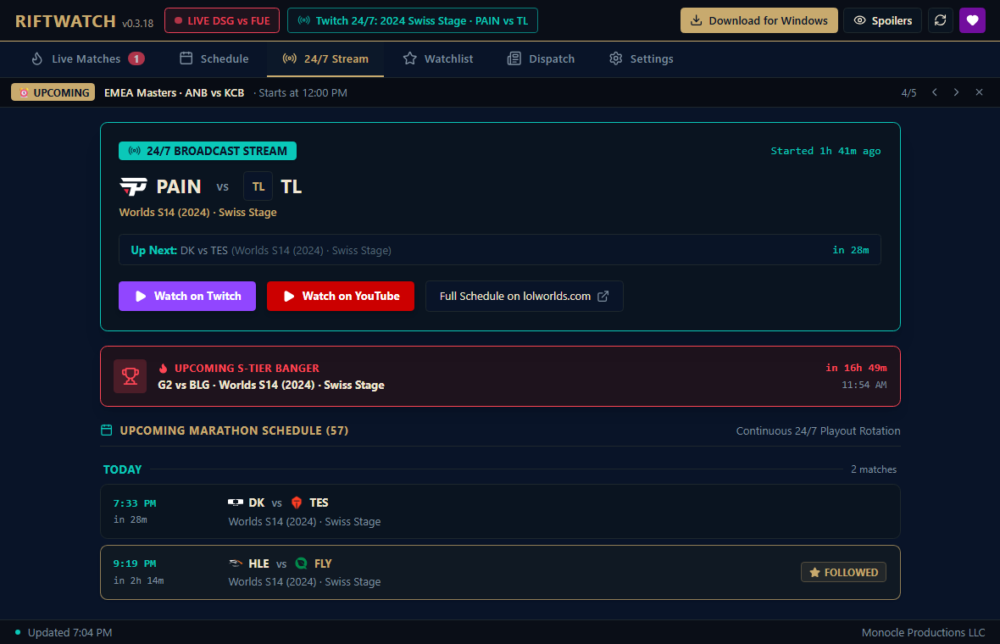

# ⚡ RiftWatch

**Live League of Legends esports scores, schedules, official standings and all-time head-to-head records, in your browser or as a tiny Windows app.** Built for fans who follow more than one league, and for viewers of the 24/7 classic-tournament Twitch stream.

[](https://github.com/drmonocle/riftwatch/releases/latest)
[](#-windows-app)
[](#-windows-app)
[](https://github.com/drmonocle/riftwatch/actions/workflows/ci.yml)
[](LICENSE)

<p align="center">
  
</p>

## 🚀 Try it

| | |
|---|---|
| 🌐 **Web version** (any device, no install) | **[lolworlds.com/riftwatch](https://lolworlds.com/riftwatch/)** |
| 🪟 **Windows app** (floating ticker, tray, notifications) | **[Download RiftWatch.exe](https://github.com/drmonocle/riftwatch/releases/latest/download/RiftWatch.exe)** |

On a phone, open the web version and use **Add to Home Screen** to install it like an app.

---

## ✨ What it does

### 🔴 Live matches
Series score, game-by-game progress (`● Game 2 (Live)`) and one-tap links to the broadcast. When a match starts **late**, RiftWatch says so ("Delayed · 1h 54m late, the broadcast is on air") instead of pretending nothing is happening, and picks it up within seconds of Game 1.

### 🏆 Official standings and brackets
The same group tables, Swiss rounds and playoff brackets lolesports.com shows, for every league Riot lists (all 51). It opens on the split being played and on the stage that is underway; pick any recent split from the dropdown.

<p align="center"></p>
<p align="center"></p>

### ⚔️ All-time head-to-head (2011 to today)
Every match card carries a head-to-head meter. Tap it for the full record: games won and lost across **every tournament and region** (rebrands are combined, so SKT counts as T1), the split between Worlds / MSI / First Stand and domestic play, and the last 10 meetings with scores. The data refreshes itself every few hours.

<p align="center"></p>
<p align="center"></p>

### 📅 Schedule, 24/7 stream and watchlist
- **Schedule:** Today / Upcoming / Results, a "followed only" filter, search, and one-click **Add to Calendar** (Google, Outlook, Yahoo, Apple/ICS).
- **24/7 Stream:** what the classic-tournament marathon is airing now, what is next, and the S-tier "banger" games.
- **Watchlist:** follow teams, players, regions and leagues. Alerts, "next match you follow" and filters all follow your list.
- **Team pages:** click any team for its roster, recent results and next matches.

### 🙈 Spoiler mode
Hides scores, winners, series progress, bracket results and head-to-head scores until you reveal a match. Toggle it any time (`Ctrl+S` in the Windows app).

### 🔗 Share a match
The link icon on any match copies a link that opens it in the web version: `lolworlds.com/riftwatch/#match/<id>`.

<p align="center"></p>

---

## 🪟 Windows app

Everything above, plus things a browser can't do:

- **Floating ticker:** a slim always-on-top bar you can drag anywhere, over windowed and borderless games.
- **System tray and `Alt+Shift+L`:** summon or hide RiftWatch from anywhere in Windows.
- **Notifications and a hextech chime** when a match you follow goes live, 15 minutes before it starts, and when a legendary game airs on the 24/7 stream.
- **Start with Windows** (off by default), compact window mode, and **one-click updates**: the app verifies each download against its published SHA-256 before installing anything.

**Install:** download `RiftWatch.exe` and run it. It is one portable file: no installer, no admin rights. It uses the Microsoft Edge WebView2 runtime that ships with Windows 10 and 11.

> **"Windows protected your PC"?** RiftWatch is not code-signed yet, so Windows SmartScreen may warn the first time. Click **More info → Run anyway**. Every release publishes the SHA-256 of `RiftWatch.exe` (`RiftWatch.exe.sha256`) so you can check your download.

> **Code signing:** RiftWatch has applied for free code signing from [SignPath.io](https://signpath.io/), with a certificate from the [SignPath Foundation](https://signpath.org/). Until that is approved, releases are unsigned. See the [code signing policy](CODE_SIGNING_POLICY.md).

Keyboard (Windows app): `F5` / `Ctrl+R` refresh · `Ctrl+1…6` switch tabs · `Ctrl+S` spoiler mode · `Ctrl+D` detach / dock the ticker.

<p align="center"></p>

---

## 🔒 Privacy

No accounts, no analytics, no tracking. Your followed teams and settings stay on your device (browser storage or the app's data). RiftWatch only talks to:

| Service | Why |
|---|---|
| `esports-api.lolesports.com` | Riot's public esports data: matches, schedules, standings, rosters |
| `lolworlds.com` | The 24/7 stream schedule |
| `api.github.com`, `raw.githubusercontent.com`, `github.com` | Update checks, the self-refreshing head-to-head data, and release downloads |

The web version is served from lolworlds.com, which keeps normal web-server logs like any website.

---

## 🛠️ Build from source

Requirements: [Node.js](https://nodejs.org/) 22, [Rust](https://rustup.rs/) (stable) and the Windows C++ build tools (or the `xwin` cross toolchain, see `src-tauri/.cargo/config.toml.example`).

```powershell
npm ci
npm run tauri dev        # desktop app with hot reload
npm run dev              # browser only
npm run build:web        # the web version, built to dist-web/ for /riftwatch/
npm test                 # frontend tests
cargo test --manifest-path src-tauri/Cargo.toml
```

**How it fits together**
- `src/` React 19 + TypeScript + Tailwind. `src/platform.ts` tells the desktop app and the web page apart, and desktop-only features hide themselves in the browser.
- `src-tauri/` Tauri v2 + Rust: tray, global hotkey, floating ticker, notifications, and the verified self-updater.
- `scripts/h2h/refresh.py` + `.github/workflows/h2h-data.yml` rebuild the head-to-head data every 6 hours and publish it to the `h2h-data` branch, which the app downloads. The bundled `src/all_time_h2h.json` and `scripts/h2h/base_series.json` hold history up to 2026-09-25.
- `web/` the service worker, manifest, icons and IIS config for the web version; `scripts/deploy_web.ps1` publishes it.

**Releases** are built by GitHub Actions, not on a developer machine. Bump the version in `package.json`, `src-tauri/tauri.conf.json` and `src-tauri/Cargo.toml` (`npm run check:version` enforces that they match), then push a tag:

```powershell
git tag v0.3.18 ; git push origin v0.3.18
```

The `Release` workflow tests, builds on Windows and attaches `RiftWatch.exe`, its SHA-256 and a zip to a **draft** release. Publishing the draft is what makes it the latest release and offers it to the in-app updater.

---

## ☕ Support

RiftWatch is free and open source. If it is useful to you: **[Support on Ko-fi](https://ko-fi.com/monocle)**.

## 📜 Disclaimer

RiftWatch is an unofficial fan project by Monocle Productions LLC.

RiftWatch isn't endorsed by Riot Games and doesn't reflect the views or opinions of Riot Games or anyone officially involved in producing or managing Riot Games properties. Riot Games, and all associated properties are trademarks or registered trademarks of Riot Games, Inc.
