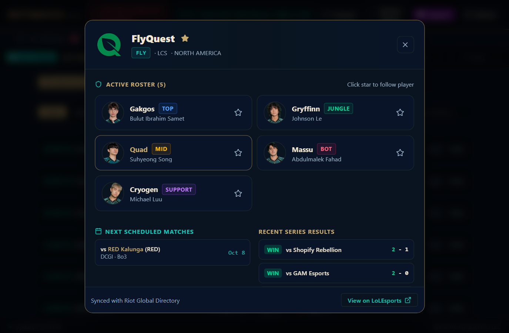
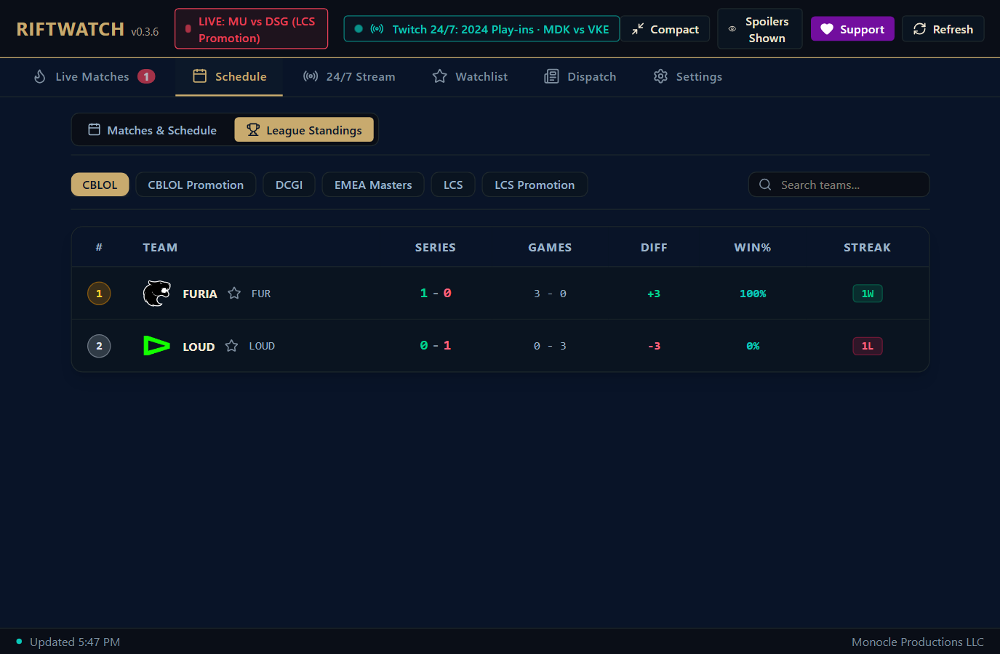
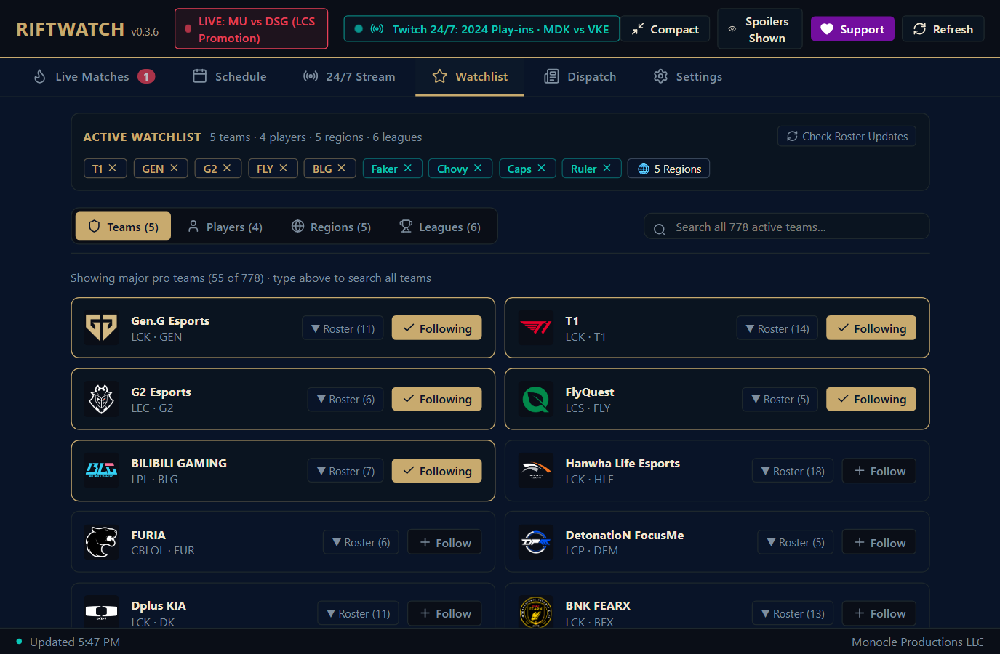
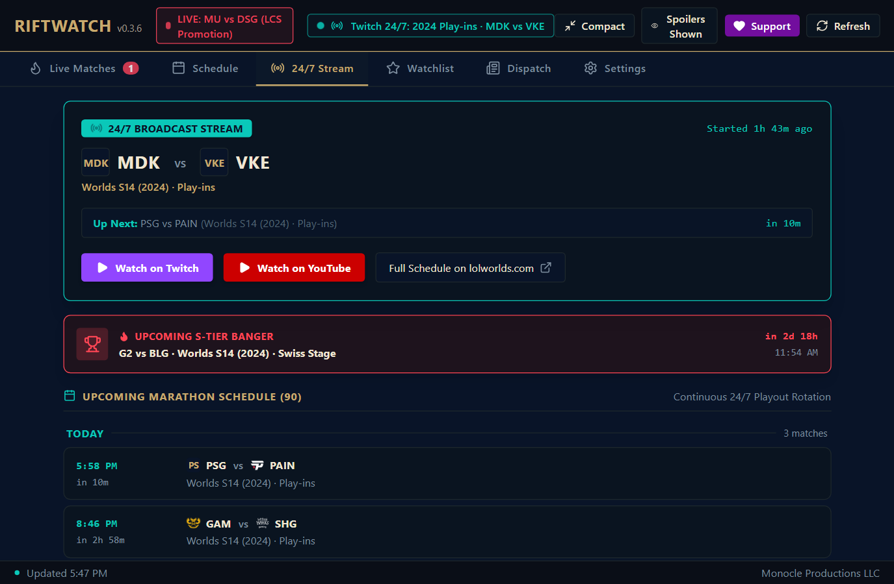

# ⚡ RiftWatch

A fast, lightweight Windows desktop app for League of Legends esports. Track live scores, view schedules, explore starting rosters, check standings, follow your favorite teams, and watch matches without opening a heavy browser.

[](https://github.com/drmonocle/riftwatch/releases)
[](#)
[](#)
[](#)
[](LICENSE)

<p align="center">
  
</p>

---

## 📥 Download for Windows

Download the latest release from [**GitHub Releases**](https://github.com/drmonocle/riftwatch/releases):

* 🚀 [**Download RiftWatch.exe**](https://github.com/drmonocle/riftwatch/releases/latest/download/RiftWatch.exe) (Portable standalone, ~3.8 MB)
* 📦 [**Download RiftWatch.zip**](https://github.com/drmonocle/riftwatch/releases/latest/download/RiftWatch-v0.3.6-windows-x64.zip) (~1.8 MB)

> **No installer or admin rights required.** Just download and launch. Optimized for Windows 10 and 11, sipping less than 40 MB of RAM.

---

## 📸 App Showcase

### 🔴 Real-Time Match Tracking & Series Progression
Real-time series scores, in-game game progression (`● Game 2 (Live)`), head-to-head records, and direct links to live Twitch/YouTube streams.
<p align="center">
  
</p>

### 👥 Team Rosters & Player Profiles
Click any team code or logo to view the starting five lineup, role badges, verified Riot player headshots, head-to-head matchup history, and recent match results.
<p align="center">
  
</p>

### 🏆 Official League Standings
Track tournament standings across LCK, LPL, LEC, LCS, CBLOL, and international events with series records, game differentials, win percentages, and streak indicators.
<p align="center">
  
</p>

### ⭐ Custom Watchlist & Global Directory
Follow your favorite teams, superstar players, leagues, and regions. Customize your feeds so you only see the matches you care about.
<p align="center">
  
</p>

### 📺 24/7 Classic Stream Marathon
Curated 24/7 LoL tournament stream guide on Twitch and YouTube. See what classic international series is on air right now with upcoming broadcast listings.
<p align="center">
  
</p>

---

## ⚡ Key Features

### 📌 Floating Ticker Bar & Desktop HUD
* Pop out a mini bar that floats on your screen while you play games or work.
* Click and drag it anywhere on your desktop; double-click anytime to restore the main window.
* Pin it on top of other windows so you never miss a match.
* Shows live scores, upcoming start times, and stream info in real-time.
* Click any match on the bar to jump straight to its details.

### 👥 Team Rosters & Player Profiles
* Click on any team name, code, or logo across the app to open the full Team Roster flyout.
* Shows starting active lineups with role badges (`TOP`, `JUNGLE`, `MID`, `BOT`, `SUPPORT`), full player names, and official headshot photos.
* Star favorite players directly from the roster to follow them on your personal Watchlist.
* Displays historical Head-to-Head (H2H) records against opponent teams and recent series results.

### 🏆 League Standings & Head-to-Head Records
* Dedicated League Standings tab inside Schedule view.
* Filter by league to check regular season standings, series records (W-L), game differentials, win percentages, and hot/cold streaks (`1W`, `3L`, etc.).
* Match cards automatically display past Head-to-Head win-loss records between the two contesting teams.

### 📊 Live Game Deep Stats & Series Progression
* Live match cards feature animated live pills showing the exact game currently on Summoner's Rift (`● Game 2 (Live)`).
* Series progress pills allow you to track multi-game Bo3 and Bo5 momentum at a glance.

### ⌨️ Global Summon Hotkey & LoL Kickoff Audio
* **Global Win32 Hotkey (`Alt+Shift+L`)**: Summon RiftWatch instantly to the foreground from inside full-screen games or workflows.
* **Hextech Kickoff Audio**: Optional procedural synthesized hextech audio chime that plays when a followed match goes live.
* **Compact Mode**: Quick toggle in the titlebar for low-profile window sizing.
* `F5` / `Ctrl+R` — Refresh live scores immediately.
* `Ctrl+1..6` — Fast-switch between Live, Schedule, 24/7 Stream, Watchlist, News, and Settings.
* `Ctrl+S` — Toggle Spoiler Mode instantly.
* `Ctrl+D` — Toggle Detached Floating HUD mode.

### 🙈 Spoiler Mode & Per-Match Reveal
* Hate spoilers? Turn on Spoiler Mode in one click to mask scores and winners.
* Click any individual masked "VS" score to reveal just that match without spoiling other series on the slate.

### ⭐ Watchlist & 1-Click Following
* Follow your favorite **Teams** (T1, Gen.G, G2, FlyQuest, BLG, etc.) from the Watchlist or directly from match cards.
* Follow your favorite **Players** (Faker, Chovy, Caps, Ruler, etc.).
* Pick which **Regions** and **Leagues** you care about (LCK, LPL, LEC, LCS, Worlds, MSI, etc.).
* Filter schedules so you only see matches for the teams you follow.

### 📅 1-Click Add to Calendar
* Click the calendar icon next to any upcoming match to export it directly:
  - 🌐 **Google Calendar** (pre-filled web event composer)
  - 🍏 **Apple Calendar & Outlook Desktop** (instant `.ics` download)
  - 📧 **Outlook.com / Microsoft 365** (Outlook web event composer)
  - 🟣 **Yahoo Calendar** (Yahoo event composer)
* Automatically calculates match durations based on format (Bo1 = 1 hr, Bo3 = 2.5 hrs, Bo5 = 4 hrs).

### 📺 Broadcast Channels & Riot Live Streams
* Instant links to official broadcast streams:
  - **Twitch** official channels (LCK, LPL, LEC, LCS, RiotGames)
  - **YouTube Live** official channels (@LCKglobal, @lolesports, etc.)
  - **LoLEsports.com** official viewer portal with rewards & drops
  - Direct live feed stream URLs automatically provided when games are in progress.

### 🔔 System Tray & Native Single Instance
* Single-instance enforcement: launching a second copy brings the active RiftWatch window to the front.
* Minimizes cleanly to the system tray near your Windows clock.
* Windows autostart option on sign-in and desktop notifications for followed match kickoffs.

---

## 🛠️ How to Build from Source

Requirements:
- [Node.js](https://nodejs.org/) (v18+)
- [Rust](https://rustup.rs/) (stable toolchain)

```powershell
# 1. Clone repository
git clone https://github.com/drmonocle/riftwatch.git
cd riftwatch

# 2. Install dependencies and run Vite dev server
npm install
npm run dev

# 3. Build standalone production Windows binary
npm run build
cargo build --manifest-path src-tauri/Cargo.toml --release
```

The resulting optimized binary is located at `src-tauri/target/release/RiftWatch.exe`.

---

## ☕ Support

RiftWatch is 100% free and open source. If you find it useful and want to support ongoing development:

👉 [**Support on Ko-fi**](https://ko-fi.com/monocle)

---

## 📜 Disclaimer

RiftWatch is an unofficial fan project by Monocle Productions LLC. It is not endorsed by or affiliated with Riot Games. League of Legends and Riot Games are trademarks or registered trademarks of Riot Games, Inc.
